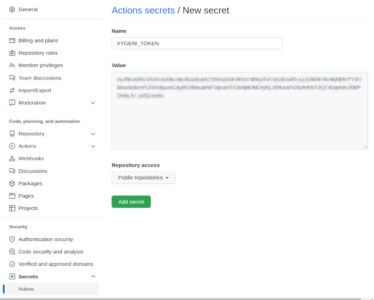

# xygeni-action

GitHub Action for Xygeni Scanner.

<!-- toc -->

- [Introduction](#introduction)
- [Usage](#usage)
  * [Setting API token as encrypted secret in GitHub](#setting-api-token-as-encrypted-secret-in-github)
  * [Add a step calling the action to a workflow](#add-a-step-calling-the-action-to-a-workflow)
  * [Parameters](#parameters)

<!-- tocstop -->

## Introduction

[GitHub Actions](https://docs.github.com/en/actions) are a platform for continuous integration in GitHub repositories. 
An action encodes a reusable task with configurable parameters.

Xygeni provides a `xygeni-action` for downloading and running the scanner as a step in a GitHub workflow.

## Usage

The `xygeni-action` downloads, configures and executes the Xygeni Scanner on the repository where the action is invoked. 

### Setting API token as encrypted secret in GitHub

The scanner needs an *API token* to communicate with the Xygeni platform. To register in the Xygeni platform, please register in the [xygeni.io](https://xygeni.io/book-a-demo). 

Such API token is a secret that could be registered safely at the appropriate scope (organization, repository or environment) using [GitHub Encrypted Secrets](https://docs.github.com/en/actions/security-guides/encrypted-secrets).



For example, to register the API token as a secret named `XYGENI_TOKEN`, for the repository in the current working directory, you may use the GitHub `gh` command:

```shell
# The command will prompt you to enter the secret value
gh secret set XYGENI_TOKEN

# Alternatively you may read the value of the API token from a local file
gh secret set XYGENI_TOKEN < /path/to/xygeni_token.txt
```

(You must be the repository owner for creating repository secrets.)

For creating encryption secret at environment scope in a personal account repository (you need to be the repository owner), add `--env ENV_NAME`:

```shell
# Set the secret available to private repositories only
gh secret set --env ENV_NAME XYGENI_TOKEN
```

For creating encryption secret at organization scope (so the secret is available to all or a subset of the organization repositories), add `--org ORG_NAME`:

```shell
# GitHub CLI does not have admin:org permission by default
gh auth login --scopes "admin:org"

# Set the secret available to private repositories only
gh secret set --org ORG_NAME XYGENI_TOKEN

# Or set the secret available to all organization repositories
gh secret set --org ORG_NAME XYGENI_TOKEN --visibility all

# Or limit visibility of the secret to the selected repos
gh secret set --org ORG_NAME XYGENI_TOKEN --visibility all
```

You may use the corresponding GitHub webpages for setting the api token as a secret named `XYGENI_TOKEN` at the appropriate scope.

### Add a step calling the action to a workflow

In a GitHub workflow (`.github/*.yml`) the Xygeni scanner could be run on the repository files, 
typically after `actions/checkout` to retrieve the branch sources. 
The `GITHUB_WORKSPACE` environment variable will contain the default location of the repository when using the checkout action.

You can configure a GitHub action with the form:
```yaml
on:
  workflow_dispatch:
  push:
    branches: [ main, develop ]
  pull_request:
    branches: [ main, develop ]

jobs:
  xygeni-scan:
    runs-on: ubuntu-latest
    name: xygeni-github-action
    steps:
      # Checkout the repository sources (GITHUB_WORKSPACE)
      - name: Checkout
        uses: actions/checkout@vv3.1.0
        
      - name: Xygeni-Scanner
        uses: xygeni/xygeni-action@v2.0
        id: Xygeni-Scanner
        with:
          token: ${{ secrets.XYGENI_TOKEN }}
```

Where `XYGENI_TOKEN` is the name of the encrypted secret where the API token was saved.


### Parameters

Only the API token (or alternatively the username + password) is required.

The default values for some parameters can be changed. For example, you may specify a specific name for the project instead of the GitNug repository name (GITHUB_REPOSITORY). Also, you may want to scan a particular source subdirectory instead of the default, por example `${{ github.repository }}/src`. 
You can see more information about default GitHub environment variables [here](https://docs.github.com/en/actions/learn-github-actions/environment-variables#default-environment-variables).

The available parameters for the action are:

| Parameter            | Description                                                                                                                                                    | Mandatory | Default value                  |
|----------------------|----------------------------------------------------------------------------------------------------------------------------------------------------------------|-----------|--------------------------------|
| xygeni_url           | Base URL of the Xygeni API.                                                                                                                                    | false     | https://api.xygeni.com         |
| project              | Project name                                                                                                                                                   | false     | ${{ github.repository }}       |
| directory            | Directory to analyze                                                                                                                                           | false     | ${{ github.workspace }}        |
| token                | API token                                                                                                                                                      | false     |                                |
| username             | Xygeni account's username. Not recommended, use token instead.                                                                                                 | false     |                                |
| password             | Xygeni account's password. Not recommended, use token instead.                                                                                                 | false     |                                |
| run                  | Comma-separated scans to run: any, deps, secrets, misconf, codetamper, iac, compliance (all if not specified)                                           | false     |                                |
| include              | Include patterns, comma-separated                                                                                                                              | false     |                                |
| exclude              | Exclude patterns, comma-separated. Example: "**/test/**"                                                                                                       | false     |                                |
| output               | Output file template (filename will be prefixed by "SCAN"). Use "stdout" or "-" for standard output, "stderr" for standard error.                              | false     |                                |
| format               | Output format: none, text, json, csv                                                                                                                           | false     | none                           |
| columns              | Report columns, as --cols SCAN=col1,col2,...                                                                                                                   | false     | From config for each scan type |
| code                 | If true, report code blocks or sensitive text, if false the code will be obfuscated                                                                            | false     | true                           |
| conf                 | Configuration filepath template (filename will be prefixed by "SCAN")                                                                                          | false     |                                |
| baseline             | Baseline filepath template (filename will be prefixed by "SCAN")                                                                                               | false     |                                |
| custom_detectors_dir | Directory with custom detectors                                                                                                                                | false     |                                |
| detectors            | SCAN=list, comma-separated list of IDs for detectors to run, severity or "all"                                                                                 | false     |                                |
| skip_detectors       | SCAN=list, comma-separated list of IDs for detectors to ignore, or severity                                                                                    | false     |                                |
| sbom                 | SBOM file to generate. Use "stdout" or "-" for standard output, "stderr" for standard error                                                                    | false     |                                |
| sbom_format          | SBOM format: cyclonedx, spdx, swid                                                                                                                             | false     |                                |
| secrets_mode         | (Secrets) scan mode: scan, diff, history                                                                                                                       | false     | scan                           |
| standard             | (Compliance) ID of the standard to check                                                                                                                       | false     | From config file               |
| fail_on              | When the action fails: "never" (always exit with code 0, default value), list of rules, like (severity:SEV ... shortcuts) that will force a non-zero exit code | false     | never                          | 
| try_all_scans        | Try all scans, even after a scan failure or error                                                                                                              | false     | false                          |


> **Tip:** Use `fail_on = never` to avoid breaking the build if the scan finds issues or fails.
> You may also use `fail_on = severity:critical` to terminate the build only when critical issues are found.

> **Tip:** Use `run = secrets,iac` if you want to scan only for secrets and IaC flaws, for example.
